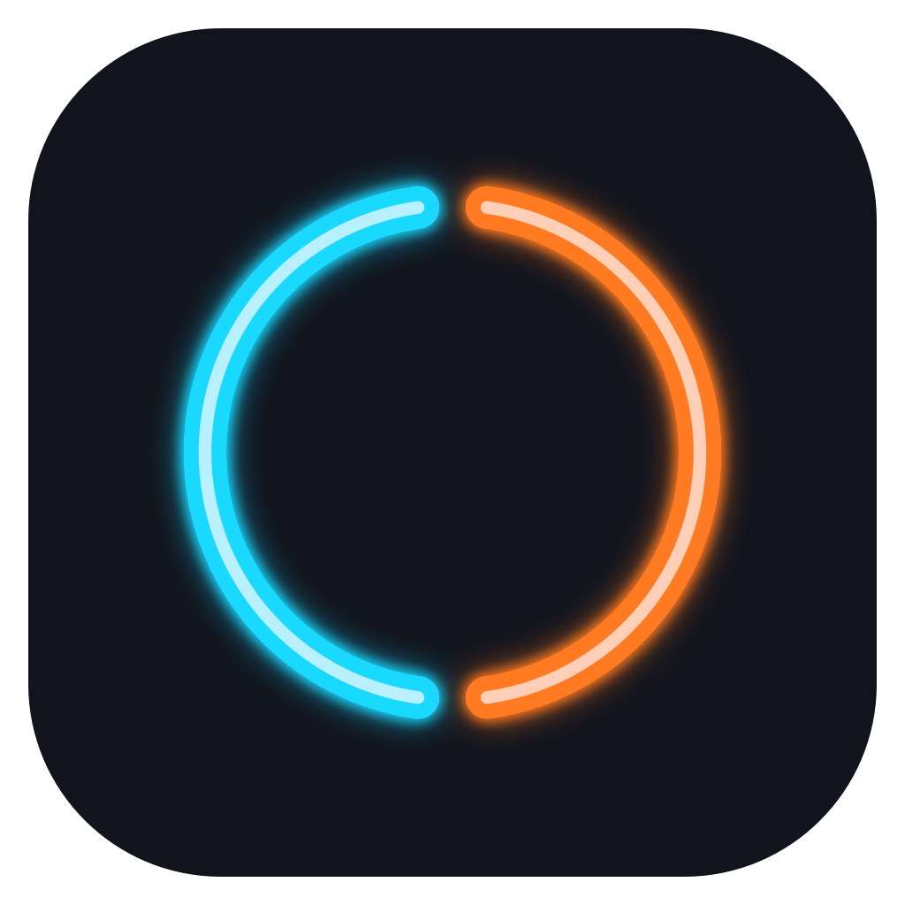

界面自动跟随系统显示语言：中文显示中文，其他语言显示英文。更改系统语言后请重启 LumaNib；已有颜色和快捷键设置保留。
<h1 align="center">LumaNib</h1>

让每一次指向，都清楚可见。

LumaNib 是一款鼠标高亮与荧光屏幕画笔工具，适合录屏讲解、软件演示和教学。

## 下载

请在 [Releases](https://github.com/GongWenAI/LumaNib/releases) 下载对应系统的完整压缩包。

| 版本 | 适用系统 | 验证情况 |
|---|---|---|
| Mac · Apple Silicon | macOS 14 或以上，M 系列芯片 | 已在 M2 / macOS 26.5 上使用并核对界面 |
| Windows · x64 测试版 | Windows 10 1809 或以上、Windows 11；64 位 Intel / AMD | 已交叉构建，64 项逻辑检查通过；Windows 实际操作与 OBS 录制尚未验证 |

当前版本：**1.58**。下载文件未做商业代码签名；Mac 包未做 Apple 公证。

## 功能

- 鼠标跟随圆环：左右半环分别选色，点击或按住对应鼠标键时发光。
- 荧光画笔：调整颜色、粗细与发光强度，保留手绘形状。
- 按一下切换绘制或按住快捷键绘制，Esc 退出。
- 撤销、清空和可选的笔迹自动淡出。
- 直接录入自定义全局快捷键。
- Mac 菜单栏 / Windows 系统托盘运行。

## 开始使用

1. 完整解压下载包。Mac 打开 `LumaNib.app`；Windows 打开 `LumaNib.exe`，保留同目录内所有文件。
2. 默认按 **Control / Ctrl + Option / Alt + D** 进入画笔，左键拖动画线，**Esc** 退出。
3. **Control / Ctrl + Option / Alt + R** 开关圆环，**Z** 撤销，**X** 清空。
4. 在“全局快捷键”中可直接输入自己的组合。
5. 使用 OBS 时请选择整个显示器采集，先录一小段确认圆环和笔迹。窗口采集、游戏采集可能遗漏效果。

Windows 包自带运行库，无需另装 .NET。首次测试步骤和自检方式随下载包提供。

## 隐私与反馈

软件本身不录屏，不主动联网，不保存键盘内容或屏幕笔迹，只保存外观与快捷键设置。点击项目地址时会通过默认浏览器打开 GitHub。

使用问题可提交到 [Issues](https://github.com/GongWenAI/LumaNib/issues)，说明系统版本、显示缩放比例和复现步骤。请勿上传密码、授权码或含私人内容的录屏。

## 版权

**© 2026 宫文。保留所有权利。**

本项目的发布不代表授予开源许可或转售许可。第三方运行库依各自许可证提供，相关声明随 Windows 下载包附带。

项目地址：[github.com/GongWenAI/LumaNib](https://github.com/GongWenAI/LumaNib)
