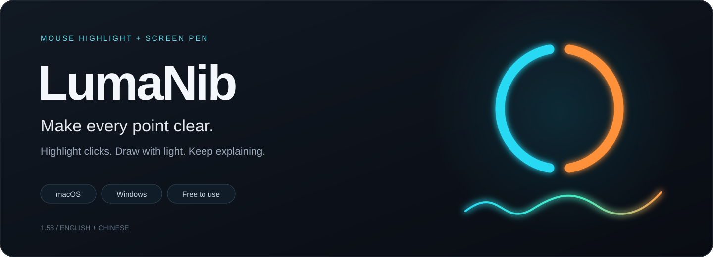
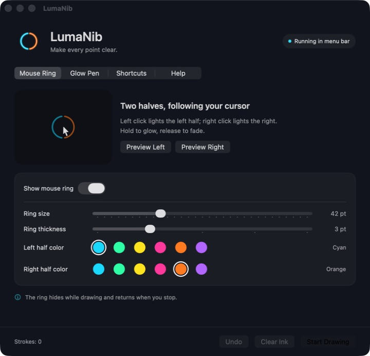
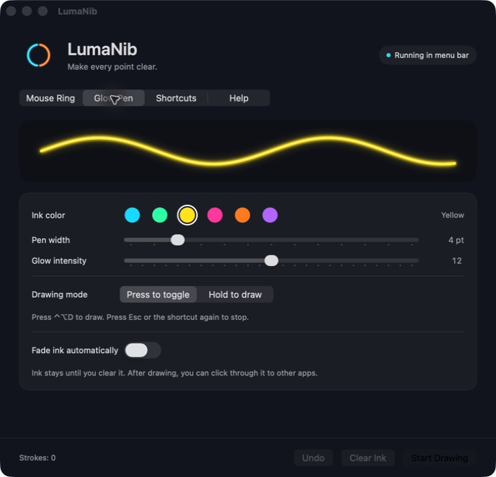

<strong>English</strong> · <a href="README.zh-CN.md">简体中文</a>

<a href="#downloads--availability">Downloads</a> · <a href="docs/GETTING_STARTED.md">Quick start</a> · <a href="docs/PRIVACY.md">Privacy</a> · <a href="SUPPORT.md">Support</a>

**LumaNib makes your cursor and annotations easier to follow during tutorials, presentations and screen recordings.** A split ring shows left and right clicks, while a glowing freehand pen lets you draw directly over your desktop.

**Free to use.** Developed by **宫文**. This repository contains product information, support resources and release packages; the application source code is not published. See [copyright](COPYRIGHT.txt).

## Point. Click. Draw.

| Make clicks visible | Draw with a glowing pen | Keep your workflow |
| :--- | :--- | :--- |
| Choose a color for each ring half. Left and right clicks light up their corresponding sides; both retain their chosen colors between clicks. | Set the ink color, width and glow. Draw freehand, undo the last stroke, clear the screen, or let ink fade automatically. | Record your own global shortcuts. Toggle drawing or hold a shortcut to draw. The interface follows your system's Chinese or English language. |

## A look inside

| Mouse Ring | Glow Pen |
| :---: | :---: |
|  |  |

*Actual macOS settings windows in English, captured from an isolated language preview of version 1.58. The banner is a brand illustration. Windows screenshots will be added after device testing.*

## Downloads & availability

**Current version: 1.58.** [Open the release hub →](https://github.com/GongWenAI/LumaNib/releases)

| Platform | Package | Requirements | Current validation |
| :--- | :--- | :--- | :--- |
| **Mac · Apple Silicon** | [LumaNib-1.58-macOS-arm64.zip](https://github.com/GongWenAI/LumaNib/releases/download/v1.58/LumaNib-1.58-macOS-arm64.zip) | macOS 14+, M-series chip | Used on M2 / macOS 26.5; Chinese and English settings checked |
| **Windows · Preview** | [LumaNib-1.58-Windows-x64.zip](https://github.com/GongWenAI/LumaNib/releases/download/v1.58/LumaNib-1.58-Windows-x64.zip) | Windows 10 1809+ or Windows 11; Intel/AMD x64 | Cross-built with logic checks; native Windows operation and OBS capture still await testing |

> Version 1.58 is available from GitHub Releases as a desktop preview. The Windows build still awaits device testing. No app-store listing is currently available.

Extract the full package before opening the app. The Windows package includes its runtime: keep all files together. The Mac build uses an ad hoc signature and is not Apple-notarized; neither package has commercial code signing. Device coverage and long recording sessions remain unverified.

## Start in a minute

1. Open **LumaNib.app** on Mac or **LumaNib.exe** on Windows.
2. Press **Control + Option + D** on Mac, or **Ctrl + Alt + D** on Windows. Drag with the left mouse button to draw.
3. Press **Esc** to stop drawing. Ink remains visible and lets clicks pass through to your apps.
4. In OBS, capture the **entire display** and make a short test recording. Window or game capture may miss the overlay.

| Default action | macOS | Windows |
| :--- | :--- | :--- |
| Toggle mouse ring | `⌃⌥R` | `Ctrl + Alt + R` |
| Start / stop drawing | `⌃⌥D` | `Ctrl + Alt + D` |
| Undo last stroke | `⌃⌥Z` | `Ctrl + Alt + Z` |
| Clear ink | `⌃⌥X` | `Ctrl + Alt + X` |
| Stop drawing / cancel shortcut capture | `Esc` | `Esc` |

Customize these in **Shortcuts** by clicking a field and pressing your combination. Chinese system languages show a Chinese interface; all other languages use English. Restart LumaNib after changing the system language.

## Local by design

No account, ads or analytics are built into the current desktop app. Mouse input and shortcut events are processed locally to provide the effects. Ink is held in memory; appearance and shortcut preferences are saved on your computer. Windows can also save a local error log and optional self-test output. Clicking a project link opens GitHub in your browser.

Read the [privacy statement](docs/PRIVACY.md) for the scope of local storage and user-submitted support information.

## Follow the project

- [Quick start & recording tips](docs/GETTING_STARTED.md)
- [Help, troubleshooting & feedback](SUPPORT.md)
- [What's in 1.58](CHANGELOG.md)
- [Platform plans](docs/ROADMAP.md)

**© 2026 宫文. All rights reserved.** Free use does not grant an open-source or resale license. Third-party runtimes retain their own licenses, included with the Windows package.
