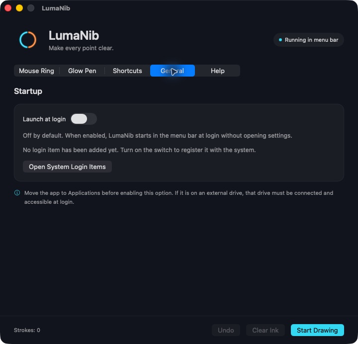

<a href="README.md">English</a> · <strong>简体中文</strong>

<a href="#下载与可用状态">下载</a> · <a href="docs/GETTING_STARTED.md#简体中文">快速开始</a> · <a href="docs/PRIVACY.md#简体中文">隐私说明</a> · <a href="SUPPORT.md#简体中文">使用支持</a>

**LumaNib 让观众更容易看清你指向哪里、点击哪里、强调什么。** 鼠标跟随圆环分成左右两半，分别显示左键和右键操作；荧光画笔可以直接在桌面上画线，适合录屏讲解、软件演示和教学。

**免费使用，作者：宫文。** 本仓库提供产品介绍、使用支持和发布包，应用源码未公开。版权说明见 [COPYRIGHT.txt](COPYRIGHT.txt)。

## 点击看得见，重点画得出

| 鼠标点击高亮 | 荧光手绘标注 | 按自己的习惯操作 |
| :--- | :--- | :--- |
| 左右半环分别选色，平时保留各自颜色，按下对应鼠标键时发光，松开后淡出。 | 调整笔迹颜色、粗细和发光强度。支持撤销、清空和自动淡出，保留原本的手绘形状。 | 直接输入自定义全局快捷键，选择按一下切换或按住绘制。界面随系统语言自动显示中文或英文。 |

## 看看软件界面

| 鼠标圆环 | 荧光画笔 |
| :---: | :---: |
|  |  |

*上图来自 1.59 版的 macOS 英文界面独立预览，是真实窗口截图；顶部横幅为品牌示意图。中文系统自动显示中文。Windows 截图将在实机测试后补充。*

## 下载与可用状态

**当前版本：1.59。** [打开 Releases 发布页 →](https://github.com/GongWenAI/LumaNib/releases)

| 平台 | 文件名 | 系统要求 | 当前验证情况 |
| :--- | :--- | :--- | :--- |
| **Mac · Apple Silicon** | [LumaNib-1.59-macOS-arm64.zip](https://github.com/GongWenAI/LumaNib/releases/download/v1.59/LumaNib-1.59-macOS-arm64.zip) | macOS 14 及以上，M 系列芯片 | 已在 M2 / macOS 26.5 上使用，并核对中英文设置界面 |
| **Windows · 测试版** | [LumaNib-1.59-Windows-x64.zip](https://github.com/GongWenAI/LumaNib/releases/download/v1.59/LumaNib-1.59-Windows-x64.zip) | Windows 10 1809 及以上或 Windows 11；Intel/AMD 64 位 | 已交叉编译并完成逻辑检查，Windows 实际操作和 OBS 实录仍待测试 |

> 1.59 桌面预览版已在 GitHub Releases 提供下载。Windows 版仍待实机测试，目前还没有应用商店上架链接。

请完整解压再打开。Windows 包自带运行库，需保留同目录全部文件。Mac 包使用临时签名，未做 Apple 公证；两个包均未做商业代码签名。尚未覆盖所有设备和长时间录制场景。

## 一分钟开始用

1. Mac 打开 **LumaNib.app**；Windows 打开 **LumaNib.exe**。
2. Mac 按 **Control + Option + D**，Windows 按 **Ctrl + Alt + D**，再用鼠标左键拖动画线。
3. 按 **Esc** 退出画笔。笔迹仍在屏幕上，鼠标可以正常点击下面的软件。
4. OBS 请选择**整个显示器采集**，先录一小段确认效果。窗口采集或游戏采集可能遗漏圆环和笔迹。

| 默认操作 | macOS | Windows |
| :--- | :--- | :--- |
| 开关鼠标圆环 | `⌃⌥R` | `Ctrl + Alt + R` |
| 开始 / 退出画笔 | `⌃⌥D` | `Ctrl + Alt + D` |
| 撤销上一笔 | `⌃⌥Z` | `Ctrl + Alt + Z` |
| 清空笔迹 | `⌃⌥X` | `Ctrl + Alt + X` |
| 退出画笔 / 取消快捷键录入 | `Esc` | `Esc` |

在“全局快捷键”中点击输入框，直接按下自己的组合即可修改。中文系统语言显示中文，其他语言显示英文；更改系统语言后重启 LumaNib 生效。

**1.59 新增：** 在**“通用 → 登录后自动启动”**中开启，登录后自动在菜单栏或托盘运行，不弹设置窗口，默认关闭。[设置方法与存放位置说明](docs/GETTING_STARTED.md#登录后自动启动)。

## 在本机运行

当前桌面版没有内置账号、广告或统计分析服务。鼠标与快捷键事件在本机处理，笔迹保存在运行内存中，外观和快捷键设置保存在电脑上。Windows 还可能保存本地错误日志，以及主动运行自检时产生的结果。点击项目链接会通过浏览器打开 GitHub。

数据范围及主动提交反馈的说明见 [隐私说明](docs/PRIVACY.md#简体中文)。

## 使用与反馈

- [完整使用说明与录屏建议](docs/GETTING_STARTED.md#简体中文)
- [常见问题与反馈入口](SUPPORT.md#简体中文)
- [1.59 版本内容](CHANGELOG.md)
- [平台计划](docs/ROADMAP.md)

**© 2026 宫文。保留所有权利。** 免费使用不代表授予开源许可或转售许可。第三方运行库依各自许可证提供，相关声明随 Windows 下载包附带。
